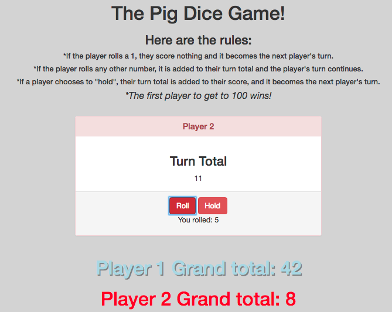

# _Pig Dice_

#### _JavaScript project with prototypes, constructors, and objects for Intro at Epicodus, 06.15.2017_

#### By _**Calla Rudolph & Dylan Lewis**_

## Description

_This project utilizes objects and prototypes to create a virtual Pig Dice game. Player 1 can click to roll the dice, which will return a random number between 1 and 6. The user can continue to roll and their score will add up. If the user rolls a 1, their turn is over and any points earned during that turn are thrown out. Player 2 has the same specs. Once a player reaches 100, the game is over._

## Specifications

1. The program can return the roll of a six-sided dice
  - example input: 4
  - example output: 4

2. The program can add the previous rolls to a turn total
  - example input: 4, 5, 6
  - example output: 15

3. The program returns 0 points for the turn if a 1 is rolled
  - example input: 4, 3, 6, 1
  - example output: 0

4. The program switches users if a 1 is rolled
  - example input: 1 (rolled by Player 1)
  - example output: Player 2's turn

5. The program adds the turn total to the grand total when the user holds
  - example input: 4,3,2,5 (hold) Grand total: 40
  - example output: 54

6. The program switches users if the user chooses to hold
  - example input: hold pressed by Player 1
  - example output: Player 2's turn

7. The program ends when a user reaches a score of 100 or more
  - example input: 5,5 Grand total: 90
  - example output: 100! You win!

## Setup/Installation Requirements

* Open GitHub site on your browser: https://github.com/CallaRudolph/pig-dice
* Select the dropdown (green box) "Clone or download"
* Copy the link for the GitHub repository
* Open Terminal on your computer and perform the following steps:
  * `$ cd desktop`
  * `$ git clone <paste-repo-url>`
  * `$ cd pig-dice`
  * `$ open index.html`
* Good luck!

## Technologies Used

* HTML
* CSS
* Bootstrap
* JavaScript
* jQuery

### License

_This software is licensed under the MIT license._

Copyright (c) 2017 **_Calla Rudolph & Dylan Lewis_**
